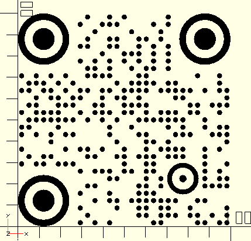

# scadqr
Effortlessly generate QR codes directly in OpenSCAD! No extra dependencies!

### Basic Example
This code...
```scad
include <qr.scad>

color("black") qr("https://github.com/xypwn/scadqr", center=true);
```
...gives us this model


### Custom Components Example
<details>
<summary>Click to expand</summary>

You can specify custom models for each module ("pixel"), position pattern and alignment pattern.
To do this, you can use the [`qr_custom()`](API.md#qr_custom---generates-a-qr-code-using-custom-elements) function. 
See the [API docs](API.md#qr_custom---generates-a-qr-code-using-custom-elements) for all the details.

The following shows an example using round components.

```scad
include <qr.scad>

color("black") qr_custom("https://github.com/xypwn/scadqr") {
    // Module
    translate([0.5, 0.5])
        scale([0.8, 0.8])
        circle(d=1, $fn=16);
    // Position pattern
    translate([3.5, 3.5]) union() {
        difference() {
            circle(d=7, $fn=32);
            circle(d=5.2, $fn=32);
        }
        circle(d=3, $fn=24);
    }
    // Alignment pattern
    translate([2.5, 2.5]) union() {
        difference() {
            circle(d=4.3, $fn=32);
            circle(d=3, $fn=32);
        }
        circle(d=1, $fn=16);
    }
}
```


</details>

### API documentation
[API.md](API.md)

### Download
[qr.scad](https://raw.githubusercontent.com/xypwn/scadqr/main/qr.scad) (36kB)

### Using the library in your OpenSCAD project
You can either
- [download](#download) the library file directly into your project folder and `include<qr.scad>` it in your main .scad file
- go to [downloads](#download) and *left click* the file instead of saving it, then copy the code in at the end of your main .scad file; you will need to do this with Thingiverse as they only accept using a single file with Customizer
- or fully [install it as a user-defined library](https://en.wikibooks.org/wiki/OpenSCAD_User_Manual/Libraries) (I don't recommend this due to the hassle with redistribution and loss of flexibility)

---

### Notes on using with Thingiverse's Customizer
This library fully supports Thingiverse's Customizer, but you will need to directly append the library code to your SCAD file, as Customizer only supports a single file.

I also noticed Customizer has some weird quirks regarding which SCAD code it will accept and which not. Here are some things you will need to pay attention to:
- NEVER use non-ASCII characters, or it will just say *"We're sorry, but something went wrong."*
- avoid functional asserts (e.g.: `function f(x) = assert(x > 0) x;`)
- some functions like `ord()` aren't available

### Development
All scripts ending with `.py` require a recent version of [Python](https://www.python.org/downloads/).

You will also need to run them from inside the cloned repo's directory.

#### Generating the library files
The source code is located in `src/` and run through the `generate.py` script in order to generate the all-in-one library files intented to be used.

The generator script mainly does two things:
- Prefix private functions/modules with `_qr_` to prevent naming collisions
- Generate documentation for public functions/modules and output it to `API.md`

Run generator (Linux/MacOS): `./generate.py`

Run generator (Windows): `py generate.py`

#### Running the tests
To confirm that QR codes are generating correctly, you can run the automatic tests **after** having run `generate.py`.

Install OpenSCAD and ZBar
- Debian-based (e.g. Ubuntu, PopOS etc.):  `sudo apt-get update && sudo apt-get -y install openscad zbar-tools`
- Arch-based (e.g. Manjaro):  `sudo pacman -Sy openscad zbar --noconfirm`
- Windows: Download and run the respective installers for [OpenSCAD](https://openscad.org/downloads.html) and [ZBar](https://zbar.sourceforge.net/download.html)

Run tests (Linux/MacOS): `./run_tests.py`

Run tests (Windows): `py run_tests.py`

If it can't find your OpenSCAD or ZBar executable, you can use the `-s` and `-z` options respectively to specify a custom path.

---
Copyright (c) 2024 Darwin Schuppan and contributors. All rights reserved.

This work is licensed under the terms of the MIT license.  
For a copy, see <https://opensource.org/licenses/MIT>.
